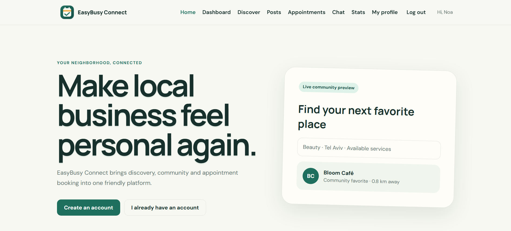
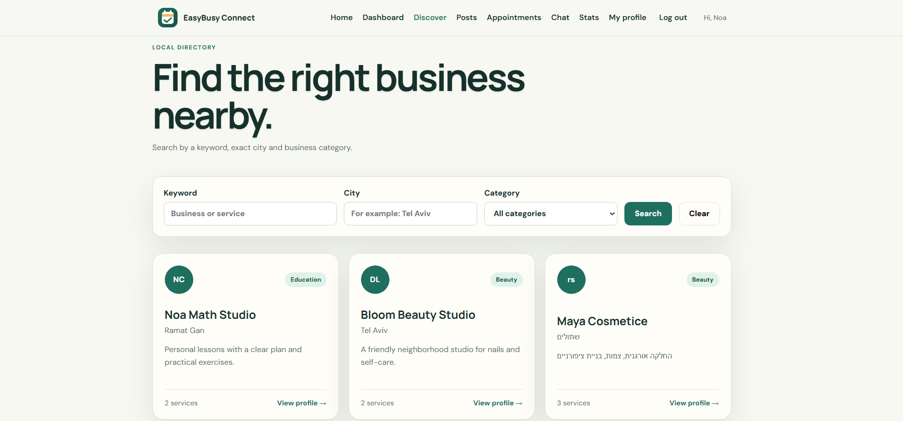
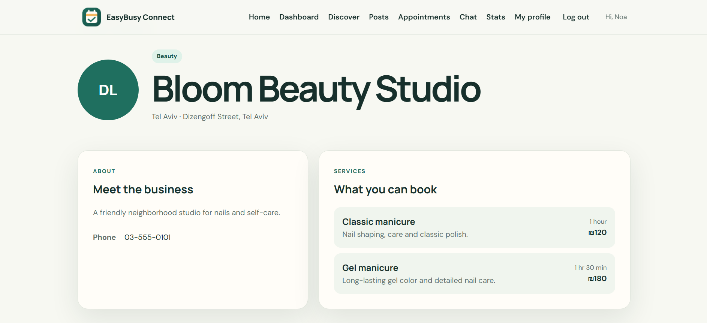
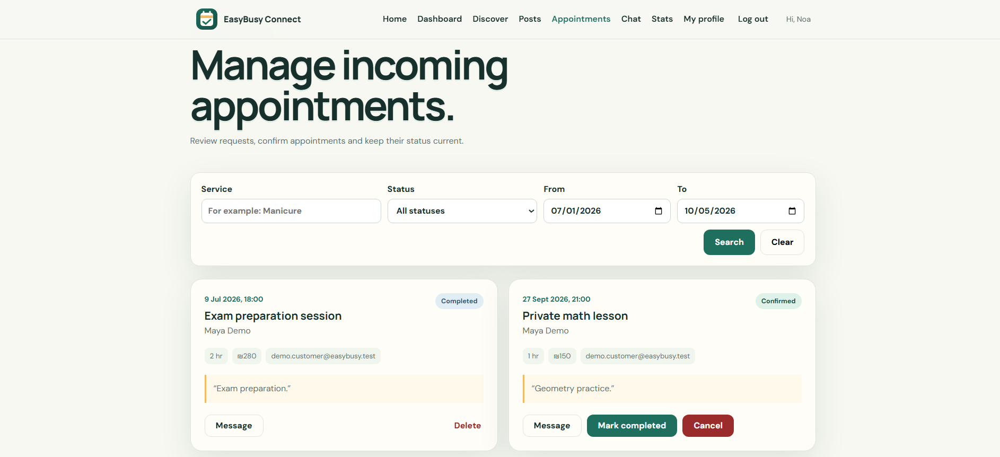
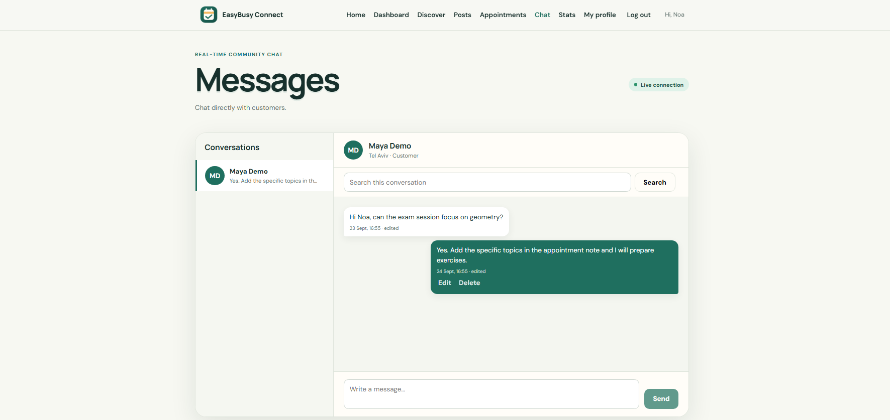
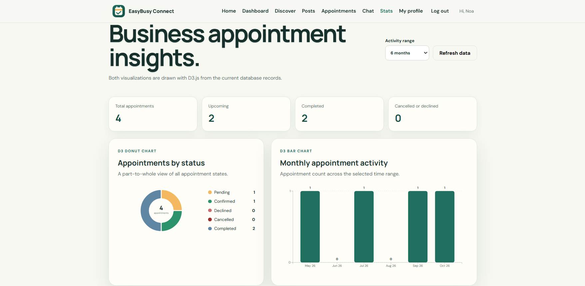
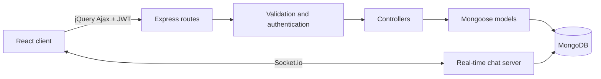

<div align="center">

# EasyBusy Connect

### A social platform that connects local businesses with their customers

Discover local services, publish community content, book appointments and chat in real time — all in one place.


</div>

## About the project

EasyBusy Connect is a full-stack social network designed for local businesses and customers. Business owners can create a professional profile, publish posts, offer services, manage appointments and communicate with customers. Customers can discover businesses, follow community updates, book services and chat with business owners in real time.

The project was developed as an academic full-stack application, with an emphasis on clean separation of responsibilities, secure authentication, role-based permissions and data-driven user interfaces.

## Main features

| Customers | Business owners |
|---|---|
| Discover businesses by keyword, city and category | Create and maintain a public business profile |
| View services and book appointments | Define services, duration and price |
| Search community posts | Publish, edit and delete image or video posts |
| Manage and reschedule bookings | Confirm, decline, cancel and complete appointments |
| Chat with business owners in real time | Chat with customers in real time |
| View personal appointment statistics | View business appointment statistics |

Additional capabilities:

- Secure registration and login with JWT and bcrypt
- Role-based authorization for customers and business owners
- Appointment overlap prevention for both participants
- Persistent message history with editing, deletion and search
- Dynamic D3.js charts backed by MongoDB aggregation pipelines
- Shared jQuery Ajax service for all REST API requests
- Video posts and a programmatically drawn Canvas logo
- Responsive interface and required CSS3 visual features
- Validation and consistent error handling across the application

## Screenshots

<table>
  <tr>
    <td width="50%" align="center"><strong>Home</strong></td>
    <td width="50%" align="center"><strong>Business discovery</strong></td>
  </tr>
  <tr>
    <td></td>
    <td></td>
  </tr>
  <tr>
    <td width="50%" align="center"><strong>Business profile</strong></td>
    <td width="50%" align="center"><strong>Appointment management</strong></td>
  </tr>
  <tr>
    <td></td>
    <td></td>
  </tr>
  <tr>
    <td width="50%" align="center"><strong>Real-time chat</strong></td>
    <td width="50%" align="center"><strong>Statistics</strong></td>
  </tr>
  <tr>
    <td></td>
    <td></td>
  </tr>
</table>

## Technology stack

| Layer | Technologies |
|---|---|
| Frontend | React 18, React Router, Vite, CSS3 |
| Data and visualization | jQuery Ajax, D3.js, Canvas API |
| Backend | Node.js, Express.js, Socket.io |
| Database | MongoDB Atlas, Mongoose |
| Authentication and security | JWT, bcrypt, Helmet, CORS, rate limiting |
| Validation | express-validator and Mongoose schemas |

## Architecture



The browser never accesses MongoDB directly. Every request passes through the Express API, where its input, identity and permissions are checked before the database is queried or updated.

## Core data models

- **User** — identity, role, public profile and optional business details and services.
- **Post** — community content with a category and optional image or video.
- **Appointment** — customer, business, service snapshot, time range and status.
- **Message** — sender, recipient, content and read status.

## Project structure

```text
EasyBusy-Connect/
├── client/
│   └── src/
│       ├── components/     Reusable UI components
│       ├── context/        Authentication state
│       ├── hooks/          Shared React and jQuery behavior
│       ├── pages/          Application screens
│       └── services/       REST and Socket.io communication
├── server/
│   └── src/
│       ├── config/         Database configuration
│       ├── controllers/    Business logic
│       ├── middleware/     Authentication, validation and errors
│       ├── models/         Mongoose schemas
│       ├── routes/         REST API endpoints
│       ├── scripts/        Safe demo-data seed
│       └── socket/         Real-time chat events
├── docs/                   Architecture and project documentation
└── package.json            Root workspace commands
```

## Getting started

### Prerequisites

- Node.js 18.18 or newer
- npm
- A MongoDB Atlas cluster or local MongoDB database

### Installation

1. Clone the repository:

   ```bash
   git clone https://github.com/mayabargig/EasyBusy-Connect.git
   cd EasyBusy-Connect
   ```

2. Install the client and server dependencies from the project root:

   ```bash
   npm install
   ```

3. Create the local environment files.

   Windows PowerShell:

   ```powershell
   Copy-Item server/.env.example server/.env
   Copy-Item client/.env.example client/.env
   ```

   macOS or Linux:

   ```bash
   cp server/.env.example server/.env
   cp client/.env.example client/.env
   ```

4. Update `server/.env` with your own MongoDB connection string and a private JWT secret containing at least 32 characters:

   ```env
   PORT=5000
   MONGO_URI=your-mongodb-connection-string
   JWT_SECRET=your-private-secret-with-at-least-32-characters
   JWT_EXPIRES_IN=7d
   CLIENT_URL=http://localhost:5173
   ALLOW_DEMO_SEED=false
   ```

5. Verify the client configuration in `client/.env`:

   ```env
   VITE_API_URL=http://localhost:5000/api
   VITE_SOCKET_URL=http://localhost:5000
   ```

6. Start the client and server together:

   ```bash
   npm run dev
   ```

7. Open [http://localhost:5173](http://localhost:5173) in the browser.

## Demo data

The optional seed command creates dedicated demo users, services, posts, appointments and message history. It is protected against accidental use in production and does not delete regular users or their content.

1. Temporarily set the following values in `server/.env`:

   ```env
   ALLOW_DEMO_SEED=true
   DEMO_PASSWORD=choose-a-private-demo-password
   ```

2. Run:

   ```bash
   npm run seed
   ```

3. Set `ALLOW_DEMO_SEED=false` again after the demo data is created.

> Never commit `.env` files, database credentials, JWT secrets or demo passwords.

## Useful commands

| Command | Purpose |
|---|---|
| `npm run dev` | Start the React client and Express server |
| `npm run seed` | Create the protected demo data set |
| `npm run build` | Build the production client |
| `npm run lint` | Run the frontend linter |
| `npm run check` | Check server syntax, lint the client and build the project |

## Security highlights

- Passwords are hashed with bcrypt and excluded from standard queries.
- Protected requests require a valid JWT in the `Authorization` header.
- REST operations enforce role, ownership and appointment-participant checks.
- Socket.io connections authenticate before joining private user rooms.
- Public profiles expose only explicitly selected safe fields.
- Authentication routes are rate-limited and common HTTP headers are hardened with Helmet.

## Project documentation

- [Architecture and request flows](docs/architecture.md)
- [Course requirements map](docs/requirements-map.md)
- [Defense preparation checklist](docs/final-defense-checklist-he.md)

## Author

**Maya Bargig**  
Computer Science student and Full-Stack Developer

- GitHub: [mayabargig](https://github.com/mayabargig)

---

<div align="center">
  Built as a full-stack academic project with an emphasis on secure, understandable and maintainable code.
</div>
